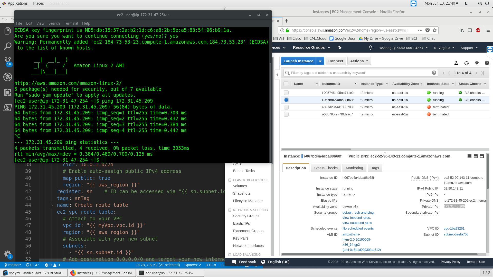
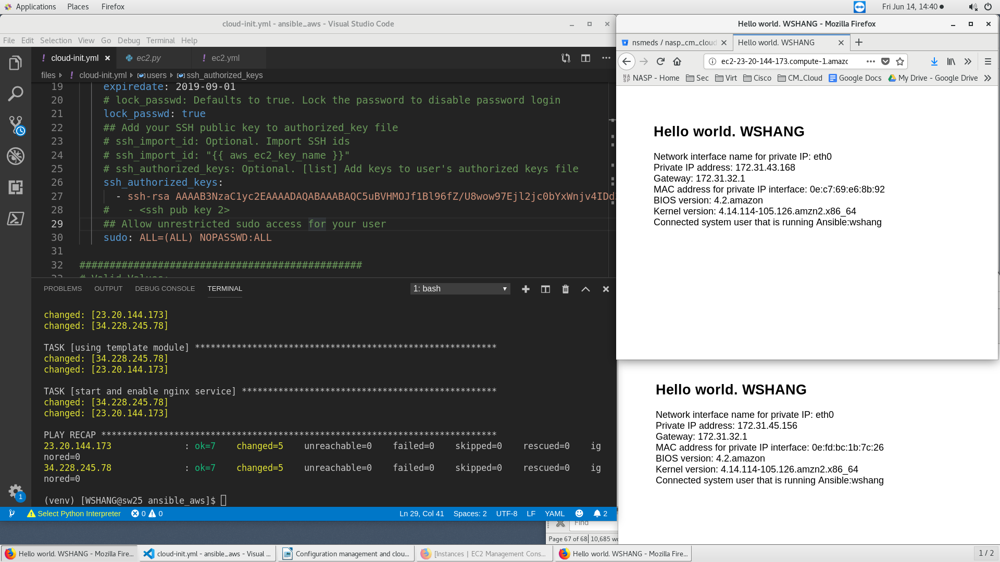
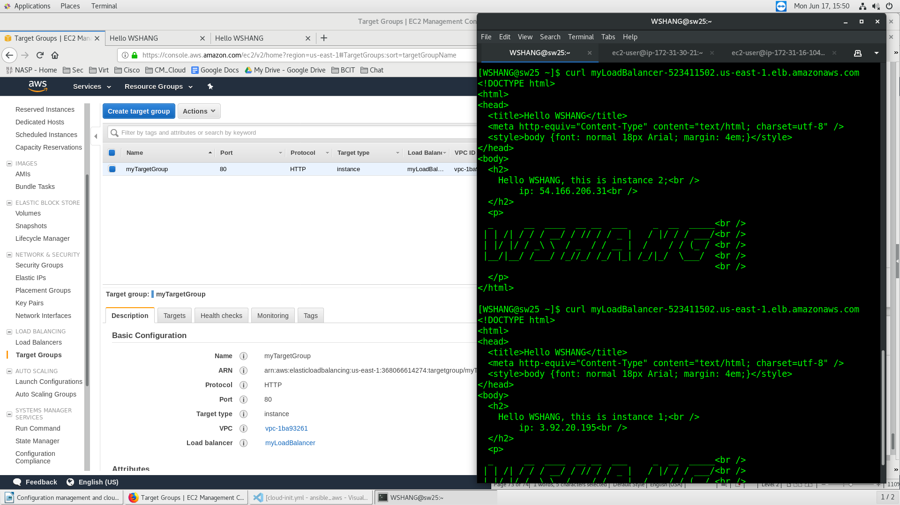
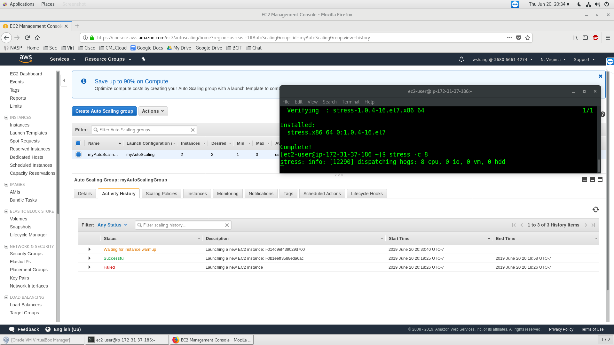

# AWS Cloud EC2 instance Webservers Automated provisioning

The scripts automates:
* Deploys multiple AWS EC2 instances via the Ansible playbook;
* Creates multiple system user, install packages, and start nginx webserver via the Ansible playbook;
    * Displays Ansible facts about the remote EC2 instances:
        * Private IP address
        * Network interface name for private IP
        * MAC address for private IP interface
        * BIOS version
        * Kernel version
        * Connected system user that is running Ansible
* Deploys the AWS Elastic Load Balancing, and AWS Auto Scaling;
    * NOTE: this part would be less tourblesome using Terraform; TO BE UPDATED...

## Screenshots:
### Automated provisioning AWS Cloud networking
#### AWS VPC components
ping test and screenshot of connection between the two EC2 instances.

### Automated provisioning AWS EC2 instance that hosts web servers
screenshot of web server's homepage. with custom facts displayed.

### Cloud load balancing and auto scaling
#### Configured AWS Elastic Load Balancing
Deployed two EC2 instances running nginx, and load balanced requests to these two servers using an AWS Application Load Balancer (ALB).

#### Configured AWS Auto Scaling
Deployed an Auto Scaling group which scales up and down based on CPU usage of the instances.

## Author
* **William SHANG** | *Email: wshang1989@gmail.com*
