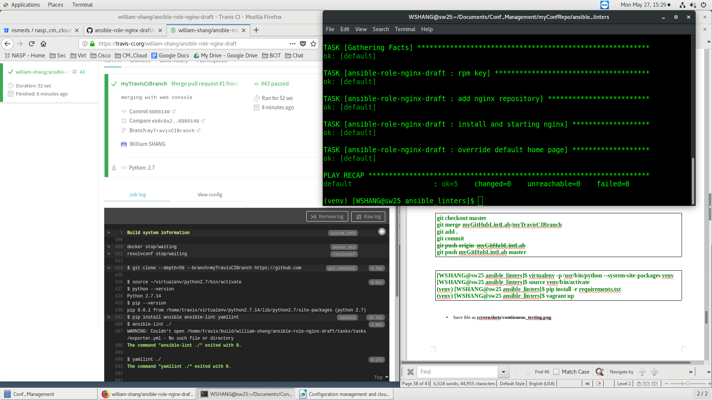

# Continuous Integration Linter Environment

The scripts automates:
* Configures Travis CI to automatically run linters whenever a commit was pushed to my development testing repo:
    * git@github.com:william-shang/ansible-role-nginx-draft.git
    * https://travis-ci.org/william-shang/ansible-role-nginx-draft

## Screenshots:
Please find below, the Screenshots of the Continuous Integration linter environment:

## Author
* **William SHANG** | *Email: wshang1989@gmail.com*

