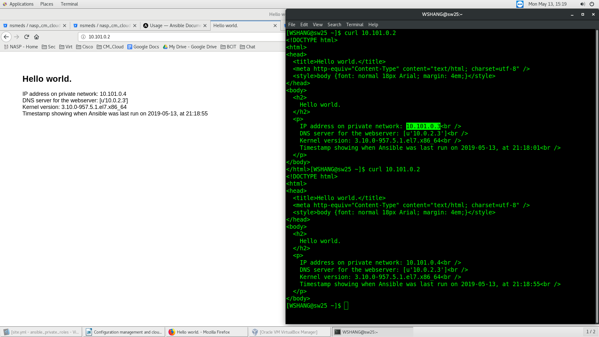

# Local load balancing NginX Webserver
The scripts automates:
* Deploys multiple VirtualBox virtual machine via the Vagrantfile;
* Creates multiple system user, install packages, and start nginx webserver via the Ansible playbook;
    * the web page would display more Ansible facts;
        * IP address on private network
        * DNS server for the webserver
        * Kernel version
        * Timestamp of when Ansible was last run
* Deploys the webservers to load balance via haproxy;

## Screenshots:
Please find below, the Screenshots of the Local haproxy load balancing NginX Webserver, and GET requests from multiple curl commands;

```
$ curl 10.101.0.2
$ curl 10.101.0.2
```



## Author
* **William SHANG** | *Email: wshang1989@gmail.com*

