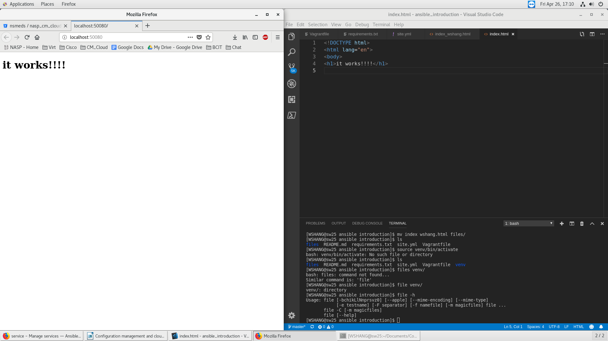

# Local NginX Webserver
The scripts automates:
* Deploys a single VirtualBox virtual machine via the Vagrantfile;
* Creates a system user, install packages, and start nginx webserver via the Ansible playbook;

## Screenshots:
Please find below, the Screenshots of the Local NginX Webserver:

## Author
* **William SHANG** | *Email: wshang1989@gmail.com*

