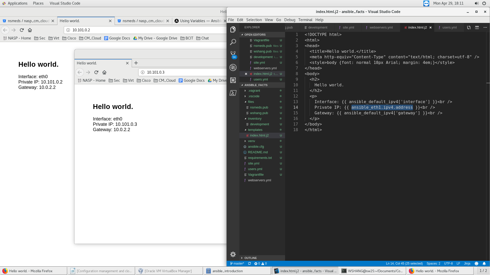

# Local NginX Webserver displaying it's own IP
The scripts automates:
* Deploys multiple VirtualBox virtual machine via the Vagrantfile;
* Creates multiple system user, install packages, and start nginx webserver via the Ansible playbook;
    * the web page would display it's own IP via Ansible facts;

## Screenshots:
Please find below, the Screenshots of the Local NginX Webserver displaying it's own IP:

## Author
* **William SHANG** | *Email: wshang1989@gmail.com*

